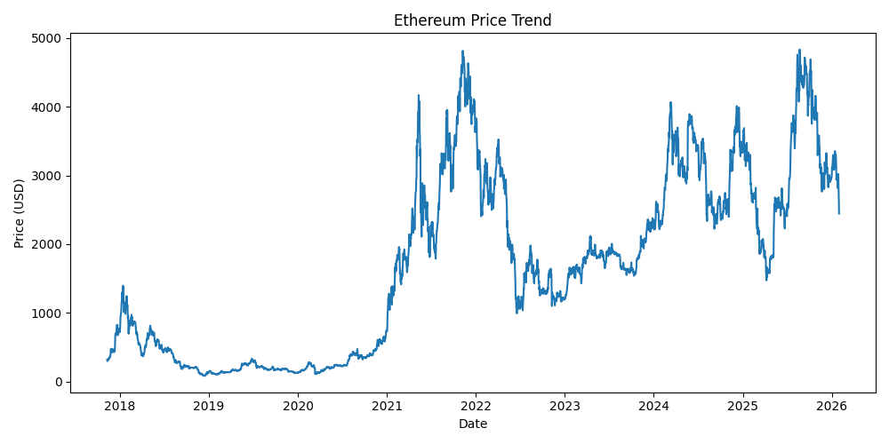
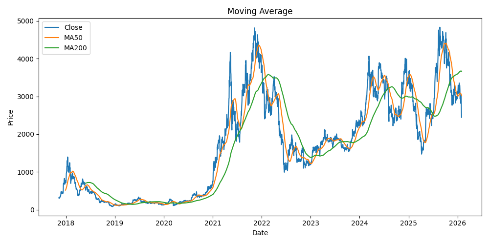
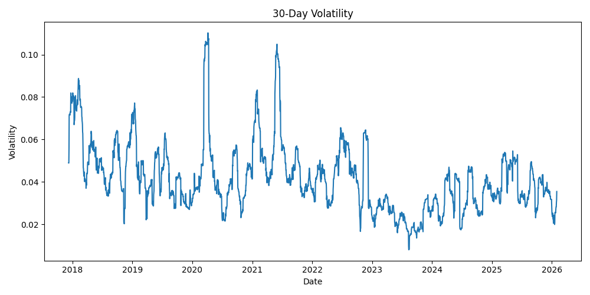
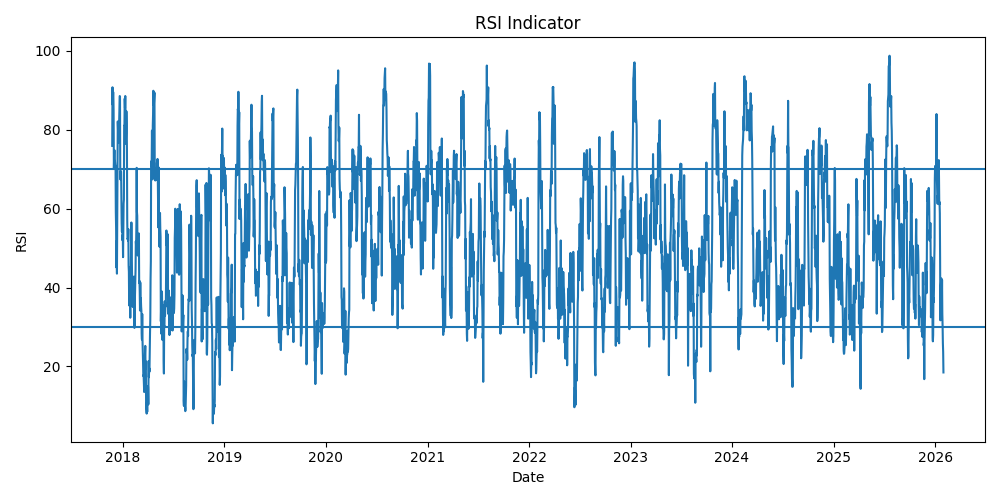

# Ethereum Price Analysis

This project analyzes historical price data of Ethereum using Python.

The analysis explores price trends, market volatility, and technical indicators to better understand the behavior of the Ethereum market.

---

## Dataset

The dataset contains historical price data for Ethereum including:

- Date
- Open price
- High price
- Low price
- Close price
- Trading volume

---

## Tools Used

- Python
- Pandas
- Matplotlib

## Project Structure

```
Ethereum_USD_Historical/
│
├── data/
│   └── ethereum_usd_historical_dataset.csv
│
├── images/
│   ├── price_trend.png
│   ├── moving_average.png
│   ├── volatility.png
│   └── rsi.png
│
├── src/
│   └── analysis.py
│
└── README.md
```

## Analysis

### 1. Price Trend

This chart shows how the price of Ethereum changes over time.



The visualization helps identify long-term growth and major market cycles.

---

### 2. Moving Average

Moving averages help smooth price fluctuations and reveal long-term trends.



The 50-day and 200-day moving averages are commonly used to detect bullish or bearish trends.

---

### 3. Volatility

Volatility measures how much the price fluctuates over time.



Higher volatility indicates more unstable market conditions.

---

### 4. RSI Indicator

The Relative Strength Index (RSI) measures market momentum.



- RSI > 70 → overbought  
- RSI < 30 → oversold

---

## Key Insights

- Ethereum shows strong long-term growth.
- Price movements often experience periods of high volatility.
- Technical indicators such as moving averages and RSI help identify market trends.

---

## How to Run the Project

Clone the repository and run the analysis script.

## Output
Charts are generated and saved in the images folder.
